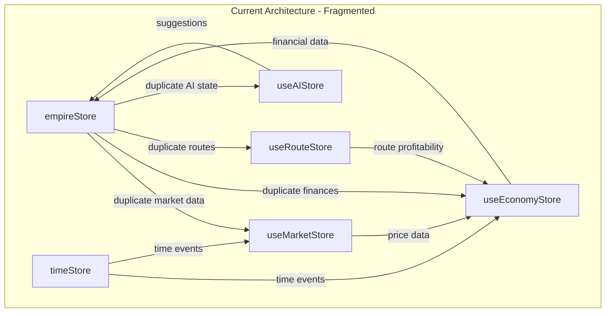
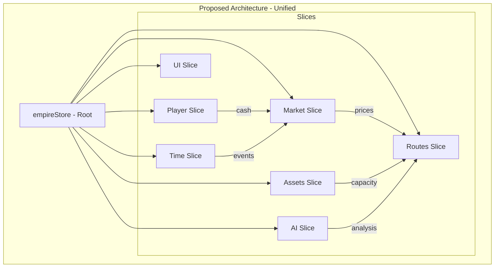

# State Management Architecture Analysis

## Current State Overview

The Flexport application currently uses 6 separate Zustand stores with significant overlap and duplication:

### 1. **empireStore** (Root Store)
- **Location**: `/src/store/empireStore.ts`
- **Purpose**: Intended as the central store for all game state
- **Key Features**:
  - Player management
  - Asset management (legacy + new system)
  - Route management (duplicated with useRouteStore)
  - Market data (partially duplicated with useMarketStore)
  - AI companion state
  - Game session management
  - UI state
  - Undo/Redo functionality

### 2. **useMarketStore**
- **Location**: `/app/store/useMarketStore.ts`
- **Purpose**: Market-specific functionality
- **Overlaps with empireStore**:
  - Market goods data
  - Price history
  - Transactions

### 3. **useEconomyStore**
- **Location**: `/app/store/useEconomyStore.ts`
- **Purpose**: Economic calculations and player finances
- **Overlaps with empireStore**:
  - Player cash/financials
  - Market state
  - Goods pricing

### 4. **useRouteStore**
- **Location**: `/app/store/useRouteStore.ts`
- **Purpose**: Route management
- **Overlaps with empireStore**:
  - Routes data
  - Route states
  - Selected route

### 5. **useAIStore**
- **Location**: `/app/store/useAIStore.ts`
- **Purpose**: AI companion functionality
- **Overlaps with empireStore**:
  - AI companion state
  - Suggestions

### 6. **timeStore**
- **Location**: `/app/stores/timeStore.ts`
- **Purpose**: Game time management
- **Minimal overlap**: Mostly independent

## Identified Issues

### 1. State Duplication
- **Player finances** exist in both empireStore and useEconomyStore
- **Market data** is spread across empireStore, useMarketStore, and useEconomyStore
- **Route data** exists in both empireStore and useRouteStore
- **AI state** is in both empireStore and useAIStore

### 2. Synchronization Problems
- No clear mechanism for keeping duplicated state in sync
- Risk of state divergence when updating the same data in multiple stores
- Potential for race conditions

### 3. Unclear Boundaries
- empireStore attempts to be a "god store" but other stores duplicate its functionality
- No clear separation of concerns
- Confusing for developers to know which store to use

### 4. Performance Concerns
- Multiple subscriptions to similar data
- Redundant re-renders
- Unnecessary memory usage from duplicated data

## State Dependency Diagram

## Proposed Unified Architecture

## Refactoring Strategy

### Phase 1: Create Unified Store Structure
1. Reorganize empireStore into logical slices
2. Create clear interfaces for each domain
3. Implement cross-slice subscriptions

### Phase 2: Migrate Functionality
1. Move market logic from useMarketStore to market slice
2. Move economy logic from useEconomyStore to player/market slices
3. Move route logic from useRouteStore to routes slice
4. Move AI logic from useAIStore to AI slice

### Phase 3: Remove Duplicate Stores
1. Update all components to use empireStore
2. Remove deprecated stores
3. Update tests

### Phase 4: Optimize Performance
1. Implement selective subscriptions
2. Add memoization for computed values
3. Optimize re-render patterns

## Benefits of Unification

1. **Single Source of Truth**: All state in one place
2. **Better Performance**: Reduced subscriptions and re-renders
3. **Easier Maintenance**: Clear structure and boundaries
4. **Type Safety**: Better TypeScript integration
5. **Improved DX**: Developers know exactly where to find/update state
6. **Reduced Bugs**: No state synchronization issues

## Implementation Priority

1. **High Priority**: Market and Economy consolidation (most duplication)
2. **Medium Priority**: Route and AI consolidation
3. **Low Priority**: Time store integration (mostly independent)

## Next Steps

1. Create detailed migration plan for each store
2. Set up automated tests to ensure no regression
3. Implement slice-based architecture in empireStore
4. Gradually migrate components to use unified store
5. Monitor performance improvements